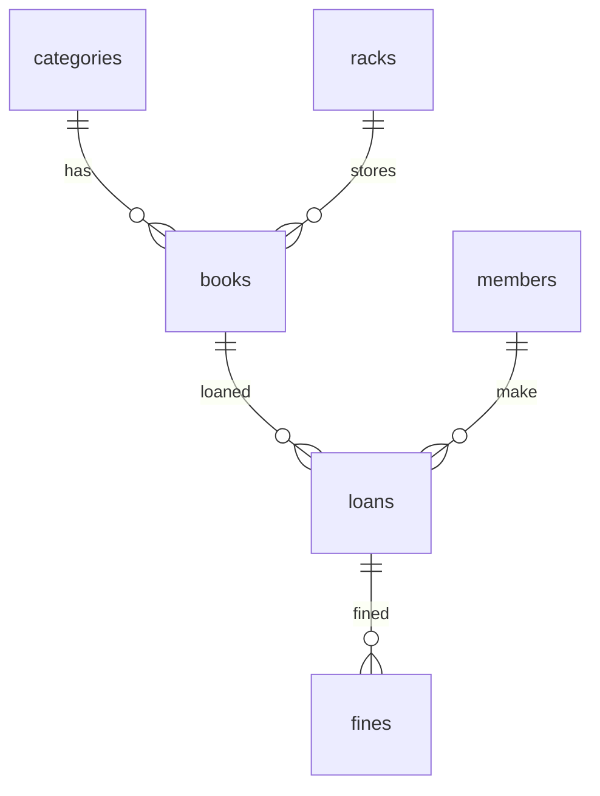

> Setiap buku hanya boleh memiliki satu kategori, sedangkan satu kategori dapat memiliki banyak buku.

# Rencana Sistem Perpustakaan Sekolah/Kampus

### Relasi Antar Tabel

-   Setiap buku (`books`) memiliki satu kategori (`categories`).

# Rencana Sistem Perpustakaan Sekolah/Kampus

---

## 1. Struktur Database & Relasi

### Relasi Foreign Key Antar Tabel

-   `books.category_id` → relasi ke `categories.id` (setiap buku punya satu kategori)
-   `books.rack_id` → relasi ke `racks.id` (setiap buku berada di satu rak)
-   `loans.book_id` → relasi ke `books.id` (setiap peminjaman untuk satu buku)
-   `loans.member_id` → relasi ke `members.id` (setiap peminjaman oleh satu anggota)
-   `fines.loan_id` → relasi ke `loans.id` (setiap riwayat denda terkait satu peminjaman)
-   `fines.member_id` → relasi ke `members.id` (setiap riwayat denda terkait satu anggota)

Relasi ini sebaiknya diimplementasikan sebagai foreign key di database agar data tetap konsisten dan mudah di-query.

### 1.6. Tabel Riwayat Denda (`fines`)

-   id
-   loan_id (relasi ke loans)
-   member_id (relasi ke members)
-   fine_type (terlambat, hilang, rusak, lainnya)
-   fine_amount
-   paid_status (lunas/belum)
-   created_at
-   updated_at

### 1.7. Tabel Lokasi Rak (`racks`)

-   id
-   name (nama rak/lokasi)
-   description (opsional)

Tambahkan kolom `rack_id` pada tabel `books` untuk relasi ke lokasi rak.

---

### 1.1. Relasi Antar Tabel & ERD

5. **racks → books**

    - Satu rak bisa berisi banyak buku.
    - Setiap buku hanya boleh berada di satu rak.
    - Contoh: Rak "A1" berisi 10 buku Matematika, Rak "B2" berisi 5 buku Fiksi.

6. **loans → fines**
    - Setiap transaksi peminjaman (loans) yang menghasilkan denda akan dicatat di tabel fines.
    - Satu loans bisa punya satu atau lebih riwayat denda (misal: denda terlambat dan rusak sekaligus).
    - Contoh: Peminjaman #123 oleh Budi terlambat 3 hari dan buku rusak, tercatat dua denda di fines.

#### Penjelasan Relasi Antar Tabel (Detail)

1. **categories → books**

    - Satu kategori (misal: Fiksi) bisa punya banyak buku.
    - Setiap buku hanya boleh punya satu kategori.
    - Contoh: Buku "Laskar Pelangi" kategori Fiksi, Buku "Kalkulus" kategori Pelajaran.

2. **books → loans**

    - Satu buku bisa dipinjam berkali-kali oleh member yang berbeda.
    - Setiap peminjaman hanya untuk satu buku.
    - Contoh: Buku "Laskar Pelangi" dipinjam oleh Budi, lalu setelah dikembalikan dipinjam oleh Siti.

3. **members → loans**

    - Satu member (siswa/guru/mahasiswa/dosen) bisa melakukan banyak peminjaman.
    - Setiap peminjaman hanya untuk satu member.
    - Contoh: Mahasiswa Budi meminjam 3 buku sekaligus, masing-masing tercatat di loans.

4. **loans**
    - Tabel loans menghubungkan member dan buku, serta menyimpan data peminjaman (tanggal pinjam, jatuh tempo, status, denda, dll).

---

> Setiap buku hanya boleh memiliki satu kategori, sedangkan satu kategori dapat memiliki banyak buku.

#### Relasi Antar Tabel

-   Buku (`books`) memiliki satu kategori (`categories`).
-   Kategori (`categories`) dapat memiliki banyak buku (`books`).
-   Anggota (`members`) dapat melakukan banyak peminjaman (`loans`).
-   Peminjaman (`loans`) terkait satu anggota dan satu buku.

#### ERD Sederhana

### 1.2. Tabel Buku (`books`)

-   id
-   title
-   author
-   category_id
-   rack_id (relasi ke racks)
-   stock
-   location
-   barcode
-   price
-   photo (path/url foto buku)

### 1.3. Tabel Kategori Buku (`categories`)

-   id
-   name

### 1.4. Tabel Anggota (`members`)

-   id
-   name
-   type (siswa/guru/mahasiswa/dosen)
-   class_or_department
-   contact
-   email

### 1.5. Tabel Peminjaman (`loans`)

-   id
-   book_id
-   member_id
-   loan_date
-   due_date
-   return_date
-   status (dipinjam, dikembalikan, hilang, rusak)
-   fine_type (terlambat, hilang, rusak, none)
-   fine_amount
-   damage_level (minimum, sedang, parah) [opsional, jika rusak]

---

## 2. Kategori Buku (Contoh)

-   Fiksi
-   Non-Fiksi
-   Referensi
-   Pelajaran Sekolah
-   Majalah/Jurnal
-   Komik
-   Biografi
-   Skripsi/Tesis/Disertasi
-   Buku Kuliah (Teknik, Ekonomi, Hukum, Kedokteran, dsb)
-   Modul Praktikum
-   Buku Digital/E-book
-   Karya Ilmiah
-   Buku Agama
-   Buku Bahasa Asing

---

## 3. Fitur Utama

### 3.1. Manajemen Buku

-   CRUD buku, barcode, stok, lokasi, harga.
-   Input barcode manual/scan.

### 3.2. Manajemen Kategori Buku

-   CRUD kategori, bisa tambah/edit/hapus sesuai kebutuhan.

### 3.3. Manajemen Anggota

-   CRUD anggota (siswa/guru/mahasiswa/dosen).

### 3.4. Aturan Peminjaman

-   Setiap member tidak boleh meminjam buku yang sama lebih dari satu kali secara bersamaan (tidak bisa pinjam buku yang sedang dipinjam).
-   Mahasiswa maksimal boleh meminjam 5 buku sekaligus.
-   Dosen maksimal boleh meminjam 20 buku sekaligus.
-   Kuota peminjaman akan otomatis bertambah kembali sesuai jumlah buku yang dikembalikan.
-   Sistem akan melakukan validasi kuota dan status buku sebelum proses peminjaman dilakukan.
-   Lama waktu peminjaman:
    -   Mahasiswa hanya boleh meminjam buku selama maksimal 14 hari.
    -   Dosen hanya boleh meminjam buku selama maksimal 1 bulan (30 hari).
-   Sistem akan otomatis menentukan tanggal jatuh tempo (`due_date`) sesuai jenis member saat proses peminjaman.

### 3.5. Peminjaman

-   Form khusus untuk proses peminjaman buku.
-   Proses peminjaman dengan scan barcode.
-   Pilih anggota yang meminjam.
-   Validasi stok buku dan status anggota.
-   Simpan data peminjaman ke database.

### 3.6. Pengembalian

-   Form khusus untuk proses pengembalian buku.
-   Scan barcode buku yang dikembalikan.
-   Pilih status pengembalian: normal, hilang, rusak.
-   Jika rusak, pilih tingkat kerusakan (minimum, sedang, parah).
-   Hitung denda otomatis:
    -   Terlambat: denda per hari (misal Rp1.000/hari).
        -   Cara mengetahui keterlambatan:
            -   Sistem membandingkan tanggal pengembalian (`return_date`) dengan tanggal jatuh tempo (`due_date`) pada data peminjaman.
            -   Jika `return_date` lebih besar dari `due_date`, maka anggota terlambat mengembalikan buku.
            -   Jumlah hari keterlambatan = selisih hari antara `return_date` dan `due_date`.
            -   Denda dihitung: jumlah hari keterlambatan x tarif denda per hari.
            -   Contoh:
                -   due_date: 10 Agustus 2025
                -   return_date: 13 Agustus 2025
                -   Keterlambatan: 3 hari
                -   Denda: 3 x Rp1.000 = Rp3.000
    -   Hilang: denda sama dengan harga buku yang hilang (misal jika harga buku Rp75.000, maka denda Rp75.000).
        -   Sistem mengambil nilai harga buku dari data buku yang dipinjam.
        -   Denda otomatis sesuai harga buku pada database.
    -   Rusak: denda persentase harga buku:
        -   Minimum: 10%
        -   Sedang: 30%
        -   Parah: 70%
    -   Semua detail denda (terlambat, hilang, rusak) akan otomatis dihitung dan ditampilkan di Form Perhitungan Denda pada proses pengembalian.
    -   Input manual denda hanya dilakukan pada kasus khusus (misal: kebijakan khusus, denda tambahan, atau kondisi tertentu yang tidak tercover otomatis).
    -   Petugas cukup melakukan proses pengembalian, sistem akan memproses dan menampilkan semua denda secara otomatis di form tersebut.

### 3.7. Form Perhitungan Denda

-   Semua detail denda (terlambat, hilang, rusak) akan otomatis dihitung dan ditampilkan di Form Perhitungan Denda saat proses pengembalian.
-   Petugas hanya perlu melakukan proses pengembalian (scan barcode, pilih status, pilih tingkat kerusakan jika rusak).
-   Sistem akan memproses seluruh perhitungan denda secara otomatis berdasarkan data peminjaman dan kondisi buku.
-   Input manual denda hanya dilakukan pada kasus khusus (misal: kebijakan khusus, denda tambahan, atau kondisi tertentu yang tidak tercover otomatis).
-   Total denda yang harus dibayar anggota langsung ditampilkan di form, tanpa input manual kecuali untuk kasus khusus.

### 3.8. Laporan & Dashboard

-   Statistik buku, anggota, peminjaman aktif.
-   Laporan denda, buku terpopuler, anggota aktif.

### 3.9. Hak Akses

-   Admin: semua fitur.
-   Petugas/kasir: peminjaman, pengembalian, input barcode, kelola anggota.
-   Anggota: lihat riwayat, status buku.

---

## 4. Alur Proses di Kasir

1. Petugas scan barcode buku.
2. Pilih anggota.
3. Proses peminjaman.
4. Saat pengembalian, scan barcode, pilih status, sistem hitung denda.
5. Tampilkan dan simpan transaksi denda.

---

## 5. Integrasi Filament

-   Resource CRUD untuk semua entitas.
-   Form peminjaman/pengembalian dengan input barcode dan status.
-   Dashboard dan laporan interaktif.

---

## 6. Catatan Tambahan

-   Kategori buku dapat ditambah sesuai kebutuhan kampus/sekolah.
-   Aturan denda bisa disesuaikan dengan kebijakan masing-masing institusi.
-   Sistem mendukung input barcode manual maupun hardware scanner.
-   Data anggota bisa diimpor dari sistem akademik jika tersedia.
-   Laporan dapat diekspor ke PDF/Excel jika diperlukan.

---

Silakan tinjau dan revisi rencana ini sesuai kebutuhan. Jika ada fitur tambahan yang diinginkan, bisa langsung ditambahkan ke dokumen ini.

1. Petugas scan barcode buku.
2. Pilih anggota.
3. Proses peminjaman.
4. Saat pengembalian, scan barcode, pilih status, sistem hitung denda.
5. Tampilkan dan simpan transaksi denda.

---

## 5. Integrasi Filament

-   Resource CRUD untuk semua entitas.
-   Form peminjaman/pengembalian dengan input barcode dan status.
-   Dashboard dan laporan interaktif.

---

## 6. Catatan Tambahan

-   Kategori buku dapat ditambah sesuai kebutuhan kampus/sekolah.
-   Aturan denda bisa disesuaikan dengan kebijakan masing-masing institusi.
-   Sistem mendukung input barcode manual maupun hardware scanner.
-   Data anggota bisa diimpor dari sistem akademik jika tersedia.
-   Laporan dapat diekspor ke PDF/Excel jika diperlukan.

---

Silakan tinjau dan revisi rencana ini sesuai kebutuhan. Jika ada fitur tambahan yang diinginkan, bisa langsung ditambahkan ke dokumen ini.
